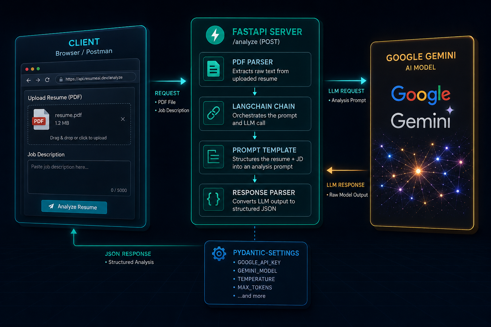

# 📄 Resume Analyzer

**An AI-powered resume analysis API that extracts insights, scores candidates, and delivers structured feedback — instantly.**

[](https://www.python.org/)
[](https://fastapi.tiangolo.com/)
[](https://www.langchain.com/)
[](https://ai.google.dev/)
[](LICENSE)
[]()

---

## 🏗️ Architecture



---

## 📌 Overview

**Resume Analyzer** is a FastAPI-based backend service that leverages **Google Gemini** via **LangChain** to intelligently analyze uploaded resumes. It accepts PDF resumes through a REST API, processes the extracted text using a large language model, and returns structured feedback — including candidate strengths, weaknesses, skill gaps, ATS compatibility, and improvement suggestions.

Designed to be lightweight and easily integrable with any frontend or recruitment workflow.

---

## ✨ Features

- 📤 **PDF resume upload** via multipart form data
- 🤖 **LLM-powered analysis** using Google Gemini through LangChain
- 📊 **Structured feedback** — strengths, weaknesses, skill gaps, and actionable suggestions
- 🎯 **Job description matching** — compare resume against a target JD
- ⚙️ **Environment-based configuration** via `pydantic-settings`
- ⚡ **FastAPI backend** with async support and auto-generated Swagger docs
- 🔌 **OpenAI-compatible** — swap Gemini for any `langchain-openai` compatible model

---

## 🗂️ Project Structure

```
resume_analyzer/
├── app/                     # Application package
│   ├── main.py              # FastAPI app entry point & route registration
│   ├── routes.py            # API endpoint definitions
│   ├── analyzer.py          # Core LLM analysis logic (LangChain + Gemini)
│   ├── parser.py            # PDF text extraction
│   ├── config.py            # Environment settings via pydantic-settings
│   └── schemas.py           # Pydantic request/response models
├── requirements.txt         # Python dependencies
└── README.md
```

> **Note:** Update the structure above to match the actual files inside `app/`.

---

## 🛠️ Tech Stack

| Component | Library / Tool |
|---|---|
| API Framework | [FastAPI](https://fastapi.tiangolo.com/) |
| LLM Framework | [LangChain](https://www.langchain.com/) |
| AI Model | [Google Gemini](https://ai.google.dev/) via `google-generativeai` |
| PDF Upload | `python-multipart` |
| Config Management | `pydantic-settings` |
| Server | [Uvicorn](https://www.uvicorn.org/) |
| Language | Python 3.10+ |

---

## ⚙️ Installation

### 1. Clone the repository

```bash
git clone https://github.com/Vigneshkumar-1211/resume_analyzer.git
cd resume_analyzer
```

### 2. Create a virtual environment

```bash
python -m venv venv
source venv/bin/activate        # macOS / Linux
venv\Scripts\activate           # Windows
```

### 3. Install dependencies

```bash
pip install -r requirements.txt
```

### 4. Configure environment variables

Create a `.env` file in the project root:

```env
GOOGLE_API_KEY=your-google-gemini-api-key
MODEL_NAME=gemini-pro
```

> Get your Gemini API key from [Google AI Studio](https://aistudio.google.com/app/apikey).

---

## 🚀 Usage

### Start the server

```bash
uvicorn app.main:app --reload
```

API will be live at `http://localhost:8000`.
Interactive docs available at `http://localhost:8000/docs`.

### Example request

```bash
curl -X POST "http://localhost:8000/analyze" \
  -H "accept: application/json" \
  -F "file=@your_resume.pdf" \
  -F "job_description=We are looking for a Python backend engineer with FastAPI and AWS experience."
```

### Example response

```json
{
  "summary": "Experienced backend developer with strong Python skills...",
  "strengths": ["FastAPI expertise", "Cloud deployment experience"],
  "weaknesses": ["No AWS certifications mentioned", "Limited team leadership examples"],
  "suggestions": ["Add quantifiable achievements", "Include AWS project details"],
  "match_score": 78
}
```

---

## 📋 Prerequisites

- Python **3.10** or higher
- A **Google Gemini API key** — [get one free](https://aistudio.google.com/app/apikey)

---

## 🤝 Contributing

Contributions are welcome! To contribute:

1. Fork the repository
2. Create a feature branch: `git checkout -b feature/your-feature-name`
3. Commit your changes: `git commit -m "feat: add your feature"`
4. Push to the branch: `git push origin feature/your-feature-name`
5. Open a Pull Request

---

## 👤 Author

**Vigneshkumar**
- GitHub: [@Vigneshkumar-1211](https://github.com/Vigneshkumar-1211)

---

*Built with FastAPI, LangChain, and Google Gemini.*

⭐ **Star this repo if you found it useful!**